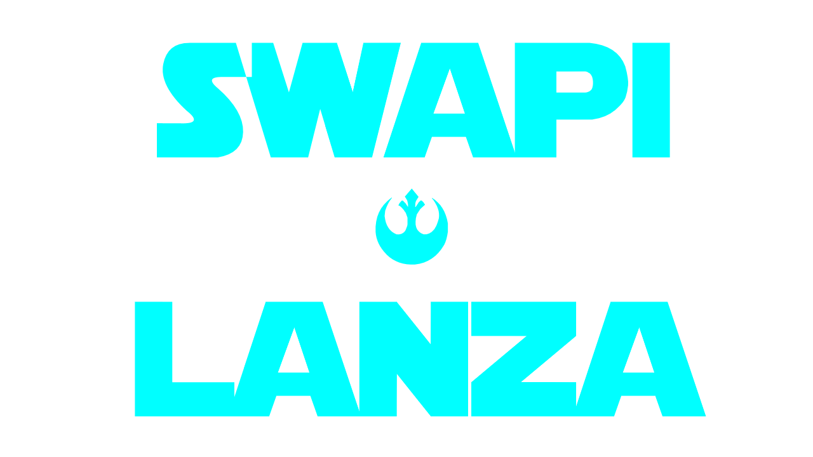

#  SWAPI - Francesco Lanza



**Autore**: Francesco Lanza.

Una applicazione realizzata in `C#` e `.NET` che prende informazioni da [swapi.dev](https://swapi.dev/).

Il codice e' commentato per una maggiore leggibilita'.

## Traccia
L’app dovrà avere le seguenti funzionalità:

- Riportare le informazioni definite nel documento StarWarsData.pdf.
- Le informazioni vanno gestite con una o più apposite classi.
- Le informazioni vanno legate ad una lista in un form XAML
- Implementare due metodi di ricerca sulla lista, tramite nome personaggio e nome pianeta.
- Dare la possibilità di salvare e caricare i dati della lista, anche i dati filtrati dalla
query, nei formati XML e/o JSON. Deve potere essere salvata lista anche con i dati
filtrati (nome a/pianeta). I file vanno salvati nella localstorage.

### Esempio di struttura dati StarWars
```
name
height
mass
skin_color
birth_year
gender
planet data: [
    name
    gravity
    terrain
    surface_water
    population
]
vehicles data: [
    name
    model
    vehicle_class
    max_atmosphering_speed
]
starships data: [
    name
    model
    manufacturer
    max_atmosphering_speed
    tarship_class
]
```

## Implementazione
Il progetto usa il pattern architetturale **MVVC**.

### Views
Faccio uso di una `NavigationView` molto semplice per poter navigare tra le Views.

Ci sono due `View` principali:

- `CharacterRequest`:
    - Prende informazioni da [swapi.dev](https://swapi.dev/), scompatta il `json` ricevuto e fa visualizzare una lista di personaggi
    con i loro relativi dettagli.
    - Permette all'utente di selezionare alcuni dei personaggi visualizzati e visualizzare i dettagli in completo al click.
    - Consente di cercare i personaggi per **nome** o **pianeta**.
- `ExportData`:
    - Permette di far salvare i personaggi salvati in formato `json` or `xml`.
    - Salva i file nel `LocalStorage` o in una directory a scelta.
    - Visualizza una lista dei personaggi selezionati prima di salvarli.

### Models
Ogni modello rappresenta un tipo di dato estraibile da [swapi.dev](https://swapi.dev/).
Per fare un migliore legame con il formato `json`, ogni attributo dei modelli e' una `JsonProperty`:

```cs
[JsonPropertyName("name")]
public string Name { get; set; }
```

### View Model
L'applicazione fa uso di un solo **View Model**: `CharacterViewModel`, che si occuipa della gestione della lista di personaggi e del loro salvataggio.

## UI
Il progetto fa uso di **UWP** per realizzare la propria interfaccia grafica.

Ho cercato di mantenere un **tema** moderno e [glassmorphism](https://www.nngroup.com/articles/glassmorphism/).